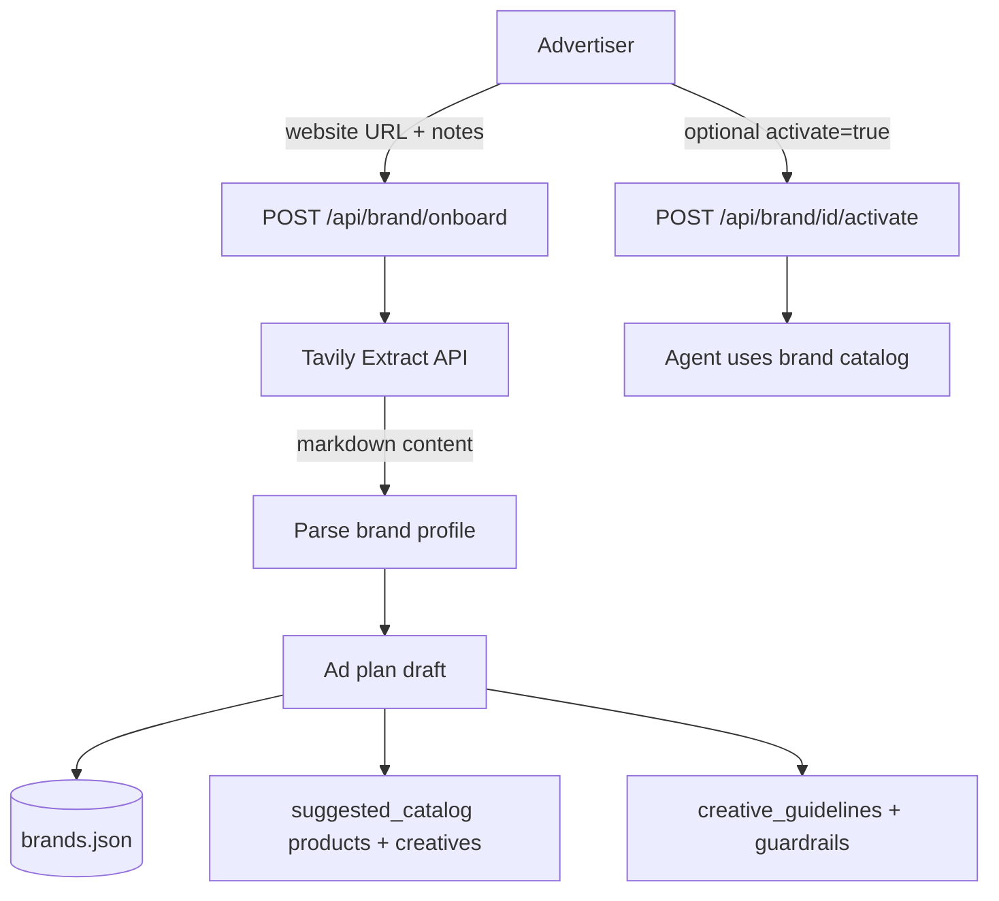
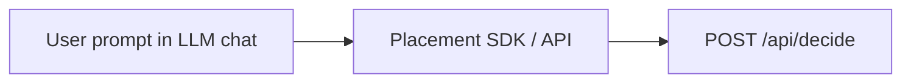
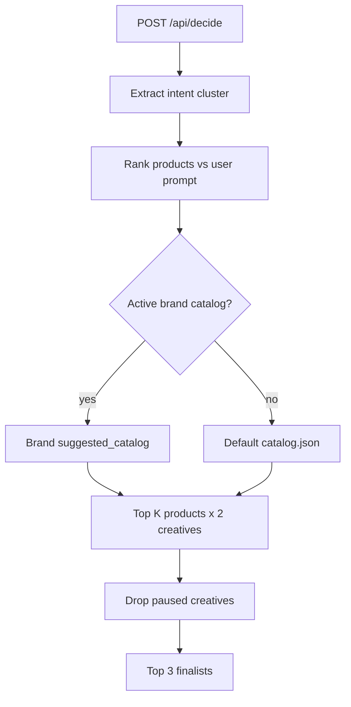
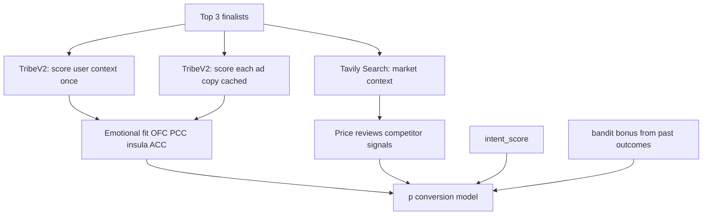
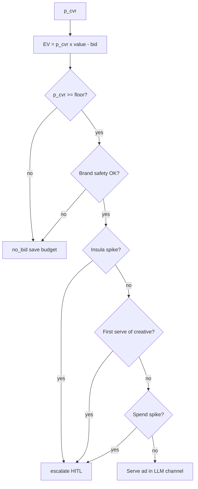
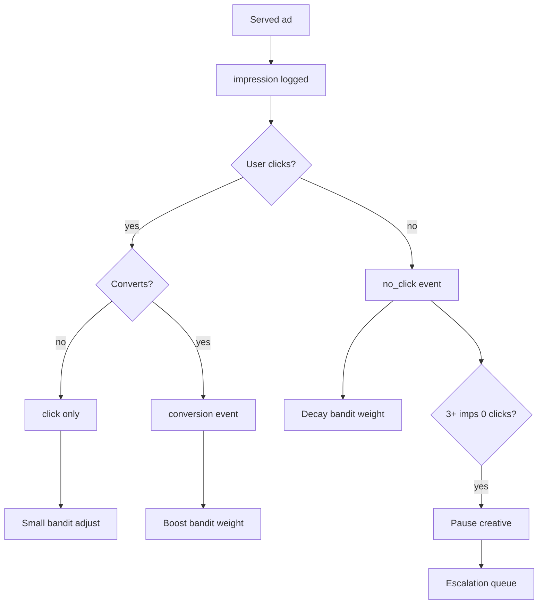
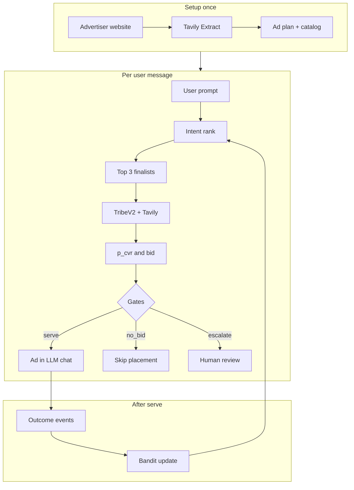

# User Interaction Flow

How the buy-side agent handles a live LLM conversation from setup through conversion feedback.

## Phase 0 — Advertiser setup (once)

Before any user sees ads, the advertiser onboards their brand.

Tavily [Extract](https://docs.tavily.com/documentation/api-reference/endpoint/extract) scrapes the advertiser's site; the agent infers voice, keywords, value props, and draft products/creatives. See [Tavily docs](https://docs.tavily.com/welcome).

---

## Phase 1 — User message arrives

A user sends a prompt inside an LLM chat (ChatGPT-style placement, Thrad app, etc.).

---

## Phase 2 — Fast path (under ~500ms)

Intent and ranking run without TribeV2.

---

## Phase 3 — Slow path (finalists only)

TribeV2 and Tavily run only on the top 3 candidates (~30–60s total with caching).

---

## Phase 4 — Bid decision and gates

---

## Phase 5 — After serve (learning loop)

Report outcomes via `POST /api/outcome` with `placement_id` and event type.

---

## End-to-end (single diagram)

---

## API quick reference

| Step | Endpoint |
|------|----------|
| Onboard brand from website | `POST /api/brand/onboard` |
| Activate brand catalog | `POST /api/brand/{id}/activate` |
| Decide on user prompt | `POST /api/decide` |
| Log impression / click / conversion | `POST /api/outcome` |
| Resolve HITL escalation | `POST /api/escalations/resolve` |
| Dashboard metrics | `GET /api/dashboard` |
